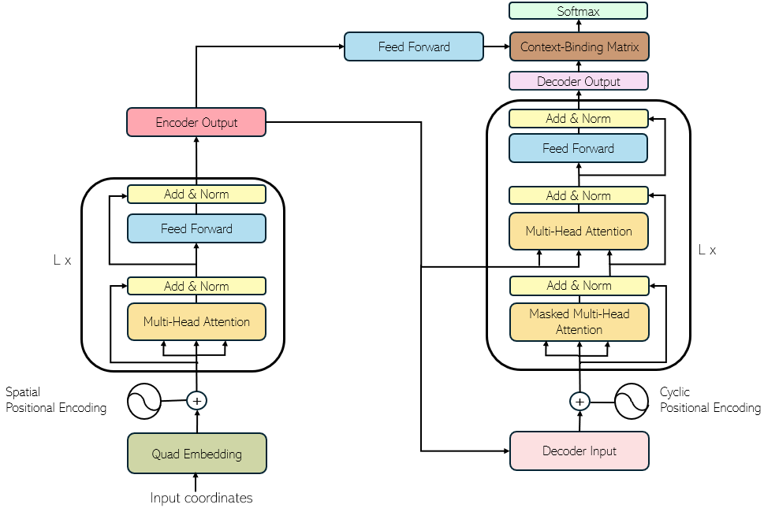

# QuaDFormer

We propose QuadFormer, a Transformer-based solver for the Traveling Salesman Problem (TSP). Acknowledging the limited informational scope of embeddings in prior Transformer-based TSP solvers, QuadFormer aims to enhance the model’s representational capacity through a more geometrically enriched embedding scheme. To this end, we introduce the following key methodological innovations. First, Recursive Fuzzy Quadrisection generates spatial representations by hierarchically encoding nodes across multiple holographic resolutions. Second, density embeddings capture geographic node distributions, employing both directionless and directional forms to represent overall crowdedness and direction-specific concentrations. Third, a Context-Binding Matrix is inserted after the decoder’s final layer to facilitate smooth information transfer between encoder and decoder. This matrix overcomes the weak token identity specific to TSP, where node representations lack consistent semantic meaning, unlike tokens in language models. By processing the encoder output, it strengthens encoder-decoder coupling. Furthermore, to fully exploit these advanced embeddings, Open-Hypothesis Decoding is applied during inference, branching multiple candidates only at the initial step to mitigate premature decision risks. Combined, these methods allow QuadFormer to effectively explore spatial distributions of TSP nodes, demonstrating superior empirical performance.


## Requirements

- CUDA 12.1
- Python 3.10.12
- Torch 2.2.0+cu121

## Pretrained Checkpoints

[Checkpoint Link](https://www.dropbox.com/scl/fo/8ssh12qu387hnxje3h7u2/AK4kBBipA-pA_RMVhTBUKwY?rlkey=cboi5htfmac9nyb76n8wjkd6v&st=muw7tnhs&dl=0)

## Datasets

[Dataset Download Link](https://www.dropbox.com/scl/fo/tw6rjngvn6sxo1k75ddej/ALJNMyz8S5OVXyXEhftbom4?rlkey=zye153wnvgx2ivm7pwea6qbol&st=uzby1k8a&dl=0)


## Build and Run Docker Container
```
docker build -t quadformer-image . 
docker run —ipc host —gpus all -it —rm —name quadformer_container quadformer_image
```


## Inference Command

```
python inference_group.py
```

Before running, please modify the following fields in the `config.yaml` file:

- Set **`G`** to **1** for *greedy decoding* and **20** for *multi-start decoding*.  
- Specify the **test dataset path** in `val_data_path`.  
- Specify the **checkpoint file path** in `resume_checkpoint`.

| **Parameter**    | **TSP-50** | **TSP-100** | **TSP-500** | **TSP-1000** |
|:-----------------|:----------:|:-----------:|:------------:|:-------------:|
| `fuzzy_depth`    | 5          | 6           | 8            | 9             |
| `feat_dim`       | 120        | 128         | 144          | 152           |

